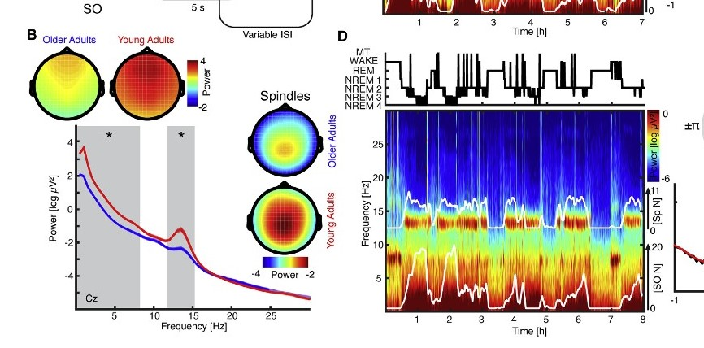

### Short Bio: ###
I am currently a 2nd year Master's student based at the MNI and I study memory in Parkinson's disease patients. I have recently collected sleep data (polysomnography; includes EEG, EOG, ECG and EMG) and I am learning how to deal with this type of data for the first time. There are a lot of things I would like to learn through brainhack, but generally I would like to learn how to pre-process the data, visualize it and maybe use machine learning to predict some outcome variables.

### Data: :zzz:
    Polysomnography (PSG) recordings of ~20 Parkinson's disease patients 
    with different severity of obstructive sleep apnea. PSG data contains:
    6 EEG channels (2 Frontal, 2 Central, 2 Occipital), 
    3 EMG channels (Chin, Right Leg, Left Leg), 
    2 EOG (Right eye, Left eye), ECG, 
    audio of snoring, and pulse oximetry (SaO2) measuring oxygen saturation. 
    Recording are nights sleep of around 8 hours for each participants.

## Brainhack 2019 
------
### Objectives   :date:
**For one patient:**
- [ ] Pre-process PSG data:
    - [X] Fit ICA
    - [ ] Use ICA to exclude artifacts
- [ ] Detection of sleep spindles using visbrain or MNE
- [ ] Detection of Slow Oscillations using visbrai or MNE
- Attempt sleep spindle localization (but I don't think i have enough electrodes for this)
- [ ] Divide data into sleep stages:
    - Will have to do this manually... or scrap PDF patient files with the sleep stage information
- [ ] Visualization: :chart_with_downwards_trend:
    - [ ] Plot topo-map of the EEG signal
        - [ ] Compute the power spectral density
        - Would like to make figures like this
    [Fig. 1B and 1D](https://www.cell.com/neuron/pdfExtended/S0896-6273(17)31073-5)
    
    - Would also like to make interactive graphs using Plotly
- If time permits, compute additional variables from the signal:
    - E.g., Use the ECG signal to compute heart rate variability
        - Use this to predict the severity of obstructive sleep apnea
### Output: :file_folder:
- Binder of Jupyter notebooks with:
    - Pre-processing:
        - Make it more of a tutorial for my lab as I am the first using this type of data
    - Visualization

*Note: I probably cannot share my data openly*
### Tools: :computer:
Aside numpy/pandas/seaborn/matplotlib,
* [MNE](https://martinos.org/mne/stable/index.html)
* [visbrain](http://visbrain.org/sleep.html)
* [Plotly](https://plot.ly/python/)
* [BioSSPY](https://github.com/PIA-Group/BioSPPy)
